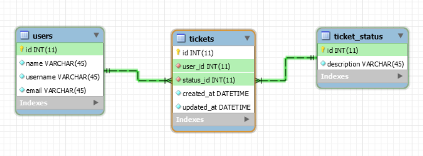

## API Double V Partners

#### Documentation: https://app.swaggerhub.com/apis/crisboleda/DoubleVPartners/1.0.0

### Installation

- Clonar el repositorio y entrar a la carpeta del proyecto

- Creamos nuestra imagen del proyecto:
```
docker build -t double_v_partners_api .
```

- Luego se ejecuta el siguiente comando para configurar los servicios:
```
docker-compose build
```

- Luego levantamos la aplicación con el siguiente comando:
```
docker-compose up
```

### Model database



